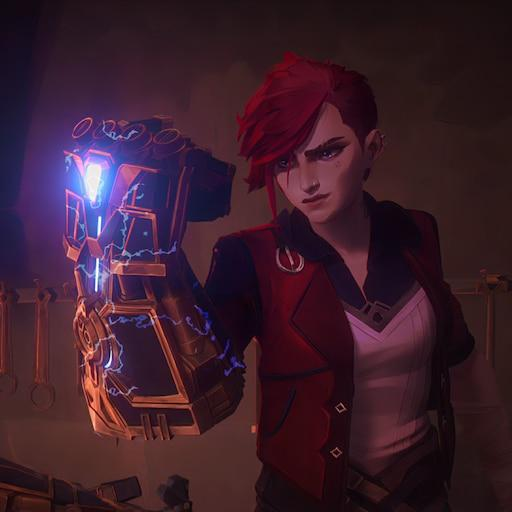

---

title: "The Making of: Atlas Gauntlets from Arcane"
description: "With a Hextech Bonus"
pubDate: 'Jul 31 2025'
heroImage: '2025/atlas_gauntlets.png'
---
import { Image } from 'astro:assets';
import PistonsMov from "./2025/pistons.webm"
import GauntletsDemo from "./2025/gauntlet_demo.webm"
import GauntletsDemo2 from "./2025/gauntlet_demo_2.webm"

import HexcoreDemo from "./2025/hexcore_demo_2.webm"

It took me 4 years to watch Arcane, the animated series.

I have kind of an odd quirk where if a TV show or book 
is too good, I deliberately
avoid watching it until either
1. The final season is announced
2. It becomes clear this work will never be completed

I put off playing Hollow Knight until Silksong came out, 
avoided _Name of the Wind_ like the plague, and yes only 
watched the first 30 minutes of Arcane in 2021 and only finished
the other 9 1/2 episodes 3 years later when the next season was
confirmed for a release date. 

This sounds insane but if you've read **Berserk** or 
_Game of Thrones_ you know that waiting is more painful
than a character death.

Anyway, once I'm into something I get dangerously obsessed.
Like, sink unreasonable time into making the stuff from whatever
I'm into. And, I got very obsessed with the **Atlas Gauntlets**

### Disclaimer: I have never played League of Legends in my life

Love her design and I love the punching things even more. I have
no hope of ever being as cool as her, but having the gauntlets is
the next best thing. So, without further ado...

 
I started with a frame built out of some stainless steel rod and
a square tube ring (a square shaped tube bent into a ring) connected
to a stainless steel duct flange. 

 
And I'm honestly proud of the duct flange, since a 4-inch inner 
diameter combined with a little cutting on the faceplate created a 
picture perfect, and surprisingly comfortable, frame for my arm size.

Next, was the hand and fingers, and my god the fingers.

If you look closely, the fingers on the gauntlets each have their own hinge
and connection. This is because in my infinite wisdom, I desperately
wanted fully articulate fingers for this hand that would only be
able to make a fist, so I 
1. Ground out 16 finger segment from a 2" steel square pipe
using an angle grinder
2. Drilled out hinge holes 
3. Fastened delicate little bolts to connect every segment together 
for every segment.

If you look closely you can see the fragmented shards of my sanity
embedded beneath the paint of each finger.

Anyway, once this was done I bought a few 'Pistons' in the form of
motor powered linear actuators; so basically not pistons at all.

<video controls={false} loop width="75%" muted  autoplay alt="Piston mechanism">
<source src={PistonsMov} type="video/mp4"  ></source>
</video>

Connected to some bidirectional switches, and mounted on the 'palm'
of the gauntlets where I can activate it with my fingers.
 You can see also above, I put in an extra circuit to monitor
the voltage of my battery, and added step down transformer to
my power source (20v power tool battery) to get the 12v the actuator
needs.

<video controls={false} loop width="75%" muted autoplay alt="Hand Mechanism">
<source src={GauntletsDemo2} type="video/mp4"  ></source>
</video>

So, after bolting down all the parts, wiring the connections together,
mounting a battery harness into the back of the gauntlets, we're left with...

<video controls={false} loop width="75%" muted  autoplay>
<source src={GauntletsDemo} type="video/mp4"  ></source>
</video>

The gold color can use some work I know, and certainly the outer
plating could use some texture to it.

But you have to admit, that's a very workable machine for punching
enforcers and long lost little siblings.

#### Bonus
And for added authenticity, I found some of these great wireless
LEDs and embedded them into a marble of resin. Then, with a magnetic
field oscillator hidden just out of view, you can light it up!

<video controls={false} loop width="75%" muted  autoplay>
<source src={HexcoreDemo} type="video/mp4"  ></source>
</video>

A little sapphire
blue resin dye and you get this beauty above. Worth risking
all of Piltover for?
 Probably not but its fun. Plus I got to
put it on a cupcake and eat it.

