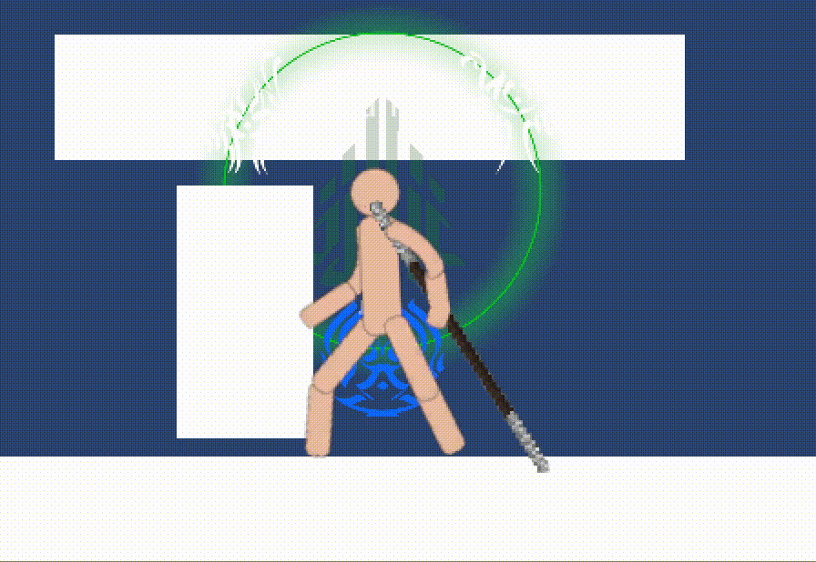

So as a look into my process, I try to set goals for myself with 
somewhat tight deadlines. Like, as tight as I think I can realistically do it.
This might seem pretty odd, but as a chronic procrastinator, the best way
to make me work is to just let myself do it at the last minute; it's just
that the last minute comes every hour or so. This works for making me finish
tasks at work and errands in my own life, and making this game is no exception.

As a rule I try to finish one of each of the following every month:
1. Render one Spren for one order.
2. Implement the prototype for one surge.
3. Animate attacks for one of the 10 radiant weapon types.

Looking at this, it's actually not that much work but I try to make it
the minimum and honestly, I don't even always get it done. If you're a 
programmer or engineer or just a creator, you might know what I mean.
Some common hold-ups include:
- Refactoring my code which can't accommodate the new stuff I'm making
- Redoing old Spren that don't match the style direction I'm going
- Redoing animations (again) because I have no animation experience
- Adding extraneous mechanics to support the surge

And the absolute worst one:
- Don't know how this feature/surge should work in-game.

You'd think that having 5 Stormlight books and 2 novellas would make
the mechanics of a surge obvious, but the problem arises from the fact
that the game does not function as a complete world.

In Roshar, there's injured and hungry people all over the continent
that would benefit from Progression to heal them and nourish crops. 
This makes a lot of sense in the kit of the Edgedancers and Truthwatchers
that want to help real people, but in the context of a single-player game,
there's a lot less you can do with it.

Sure, you can put injured NPCs all over the place and have you heal
them, but when you're playing as a radiant that can't use Progression, those
poor souls are kinda out of luck. Same with anything else that involves
helping other NPCs, not to mention that these abilities wouldn't be useful
in combat, which this game is centered around. 
That's not to say that a game _has_ to just be about fighting to be fun;
progression could possibly help in platforming areas or puzzle solving (think
growing vines to climb walls, or regenerating from a pile of mush to survive a 
bad fall) but all surges can do this and it felt like progression was sorely 
lacking in combat. 

The most obvious fix is to have progression simply augment the Radiant healing.
This is how it works in the books too, and can make for some spectacular 
regeneration displays. But the issue is that the power is only really useful
when you're behind; for skilled players, speedrunners, or people doing
no-hit runs, it's less useful. 

And, most of all, it's not interactive: a healing buff is good, but there's 
not much interaction beyond just activating it. Abrasion and Gravitation are
toggle abilities too, but they change your gameplay in an interactive way, but 
adjusting numbers just isn't quite as fun.

So that's the issue. I saw that I'd have to take some creative liberties. 

Enter the Progression Wheel. 
With this, I'm kinda taking the idea of Progression and running loosely with it.

How it works is that upon activating the surge, the Radiant has the choice between
one of three boons and curses:
#### Life
_The cells of your body are flooded with the light of Cultivation, constantly
regenerating your muscular tissue and remaking it anew._ 
This boon improves your healing, making the regeneration quicker and more efficient. 
Additionally, once when you hit 0 health, you instantly restore to half your
health at the cost of half of your maximum Stormlight (assuming you had enough).

However, this curses you with **Weakness**, which reduces your attack damage slightly.
as your cells rapidly replace themselves, they cannot maintain the same strength 
and have a slight penalty.

#### Strength
_Your muscles swell with vigor and Progress to impressive size, filling you with
strength._ 
This boon improves your attack damage, making your attacks deal significantly
more while draining a bit of stormlight with every attack. 

However, this grants you the curse of **Destination**, which slightly reduces your 
movement speed as your increased bulk makes you just a bit less agile than you 
are normally.

#### Journey
_The Stormlight in your veins fuel your metabolism, giving you a burst of 
energy and urging you to take action._ 
This boon improves your movement speed, making you move and jump much faster.
Your stormlight is passively drained at a modest rate as you move. 

However, this grants you the curse of **Death**, which reduces your rate
of healing. Your Stormlight is being routed into pure metabolic energy, 
taking away some of its natural regenerative ability.

### Explanation
This approach still more or less just adjust numbers, and yes the **Life**
mode still just increases the player's healing. The difference is that with 
this approach, there's interaction. The players will most often probably use
the **Journey** mode, but use **Life** for harder battles, and maybe use
both **Journey** and **Life** as they become more skilled. There's an element
of choice in the matter and meaningful tradeoffs.

You might have noticed that this takes some inspiration from a certain
platform fighting game franchise, and certainly in the final game I'd like
to make it deviate a lot more from that implementation. But, for now, I'm 
very happy with how the balance works, and how it happens to very perfectly
fit with the Life, Strength, Journey of the first oath.

And, as a bonus, it happens to work in theme with the Nightwatcher boon and
curse system. Absolutely, the buffs don't have to have downsides. I can 
easily make them flat buffs, but I'm a sucker for thematic choices and 
accuracy. 

And yes, the glyphs do in fact translate to Life, Strength, and Journey.

Anyway, the prototype can use some more particle effects, better animations,
probably better font and a variety of other stuff honestly. But I'll get around
to it. Until next time, here's a set of some of my TODOs:

- Add particle effects to all surges
- Redo start/end animations for buffs

